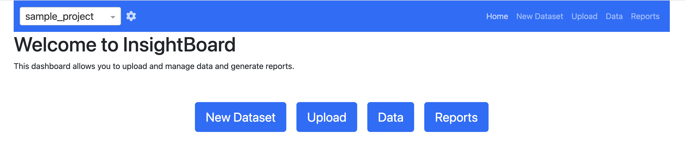
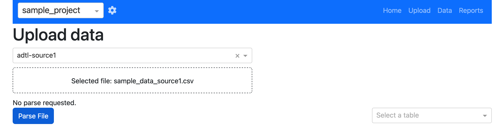
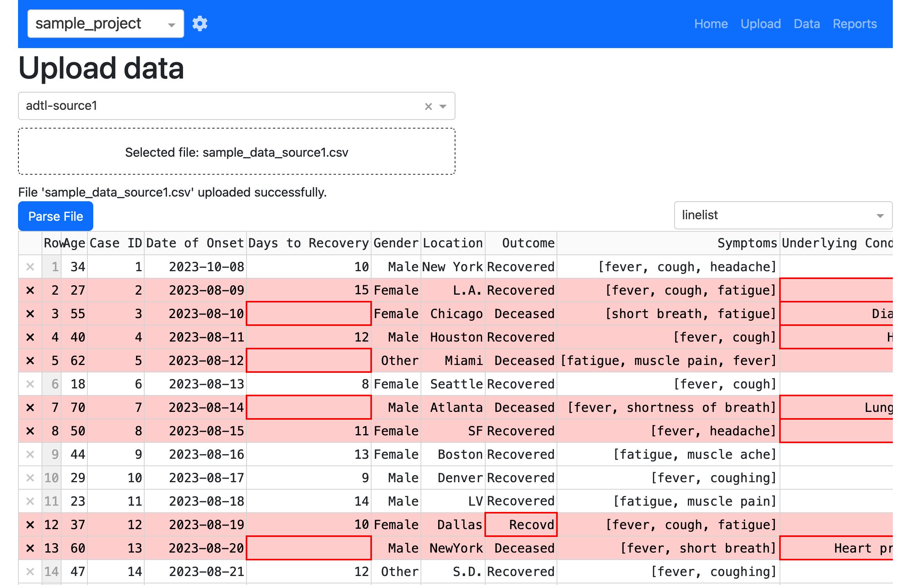
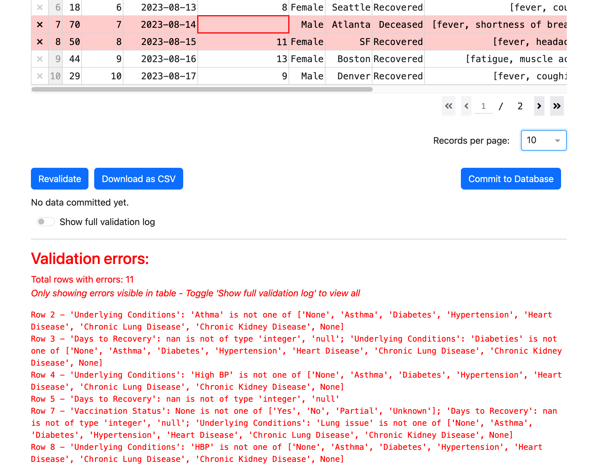
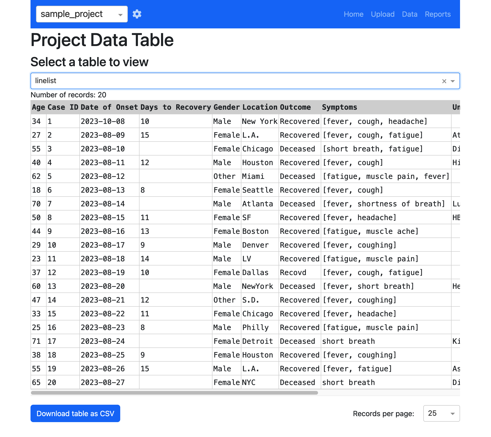
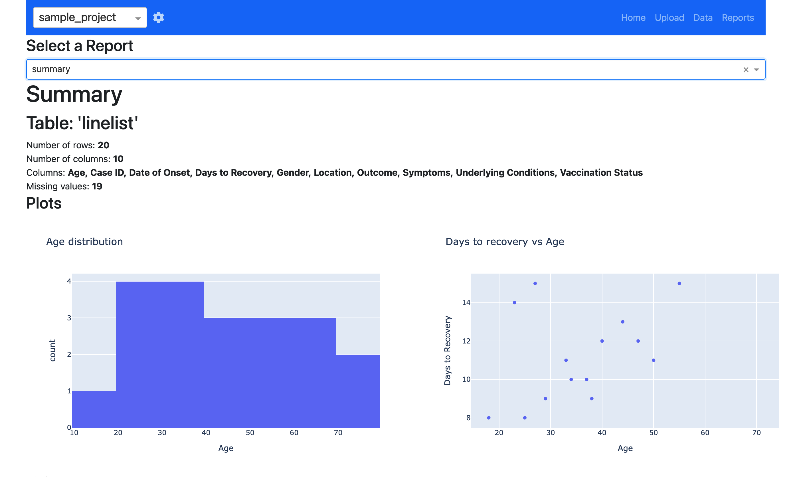

# Usage

**Insight**Board is a tool for creating and sharing interactive dashboards. It is designed to be easy to use and flexible, so you can create dashboards that meet your specific needs. For more information about projects, including how to create and manage them, see the [projects](../projects/index.md) page.

## Sample project

### Homepage

**Insight**Board comes with a sample project that demonstrates how to use the dashboard. Make sure you have installed **Insight**Board and the sample project according to the setup instructions, then launch the dashboard. You should see `sample_project` in the list of available projects in the upper-left corner. If not, please refer back to the installation instructions and ensure the project is located in the correct folder so that **Insight**Board can find it. Click on the project to open it.

You can now choose to `Upload` data into the project database, view `Data` in the database, or run `Reports` on the database. Since the sample project is empty, let's start by uploading some data. Click on `Upload` to open the upload screen.

### Upload data

The upload screen will prompt you to select a parser and a data file to ingest. The sample project comes with an `adtl` parser named `adtl-source1` and a sample data file called `sample_data_source1.csv` (located in the `sample_project/data` folder). Select the `adtl-source1` parser and the `sample_data_source1.csv` file, then click `Upload`.

The data source should convert from its native format to the target schema (these have been setup as a demonstration), but there will be some fields that do not comply with the target schema. These are highlighted in red in the datatable so that you can assess whether they need to be corrected. Hovering over the field will provide a description of the validation error so that you can make the necessary changes. Try correcting some of the fields and selecting `Revalidate` (just below the DataTable) to re-check the data.

A validation report also appears just below the table (scroll down to see it) which, by default, only shows errors for the visible portion of the table. This is useful for cross-referencing the errors with the data in the table. You can also switch the `Show full validation log` button to see all errors in the dataset.

After making some changes and revalidating, click `Commit to database` to add the data to the database. Note that you do not have to address _all_ of the changes if you need to input data quickly. A dataset will typically employ a 'PrimaryKey' (a unique identifier for an individual, for example), that will allow you to update records later as more information becomes available. When you click `Commit to database` you will be prompted with a list of tables that you are importing (the parser supports multiple table imports), through there is only one to check in this case. Click `Ok` to proceed.

### Data

On the data page you will be presented with a list of tables available in the database. When you first open the `sample_project` this list will be empty, but it will popualate as soon as you add data through the `upload` page. Click on the table you just imported to browse through the data. You will notice that any changes you applied to the data during the upload process are reflected in the database.

### Reports

Reports provide a powerful tool to interrogate the data in the database. Reports are pre-configured using templates for more information). For now we have provided a sample report called `summary` that provides a brief summary of the data in the database, along with a few visualizations. Click on the `summary` report to generate the report. This can take some time with larger databases as the reports are generated on the most up-to-date data.

